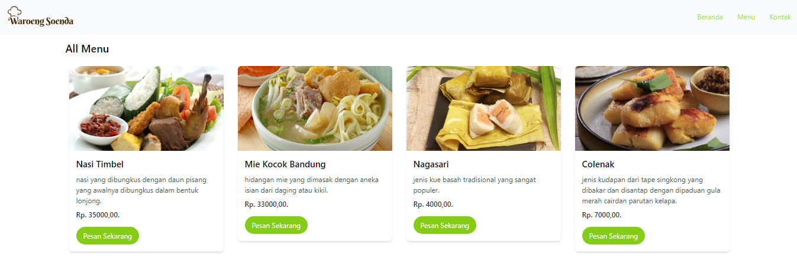

# Waroeng Soenda - Website



Ini adalah proyek website restoran sederhana yang dibangun menggunakan Tailwind CSS, PHP, dan API. Website ini memungkinkah untuk menampilkan semua data makanan dan minuman.

## Fitur Utama

- Menampilkan informasi detail tentang setiap menu.
- Menampilkan daftar menu.

## Teknologi yang Digunakan

- Tailwind CSS: Framework CSS yang digunakan untuk mengatur semua tampilan.
- PHP: Digunakan sebagai backend.
- API: Digunakan untuk mendapatkan data menu.
- Javascript : Digunakan untuk mengatur kerangka websitenya.

## Panduan Instalasi

1. Clone repositori sebagai berikut:

   ```bash
   git clone https://github.com/allfrhmn/waroeng-soenda.git
